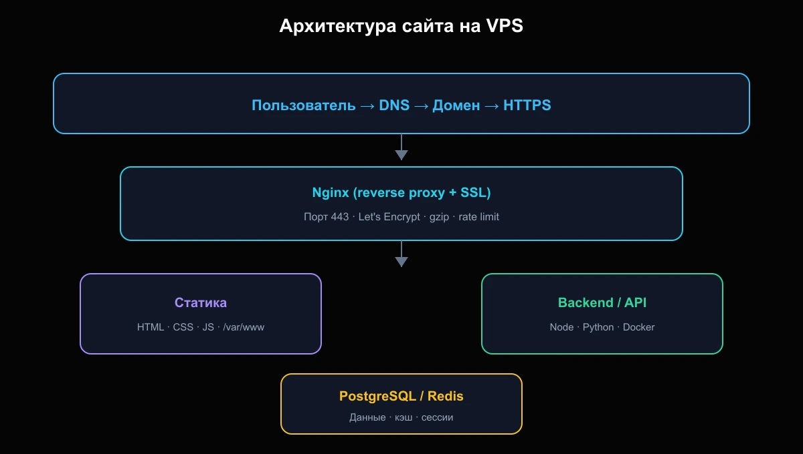
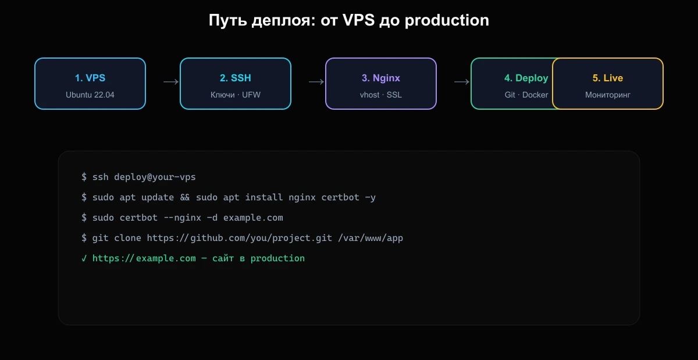
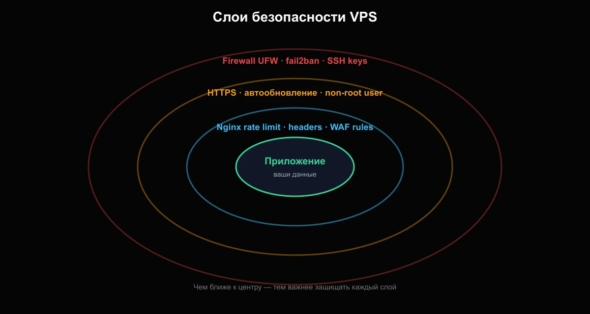

**Краткий ответ:** чтобы развернуть сайт на VPS, арендуйте сервер, подключитесь по SSH, обновите систему, настройте firewall и пользователя, установите Nginx, выпустите SSL-сертификат, загрузите код и настройте reverse proxy. На весь процесс уходит от 40 минут до нескольких часов — в зависимости от стека.

Этот гайд — самая полная инструкция в нашем блоге: от пустого VPS до работающего сайта с HTTPS, схемами архитектуры, командами и чек-листом для production.

---

## Что вы получите после прочтения

- Понимание, **как устроен сайт на VPS** — от DNS до базы данных
- **Пошаговый деплой** статического сайта и приложения за backend
- Готовые **команды и конфиги** Nginx + Let's Encrypt
- **Схемы безопасности** — что закрыть в первый день
- **Чек-лист** перед запуском в production

> **Для кого:** разработчики, которые устали от ограничений shared-хостинга, основатели pet-проектов и все, кто хочет один раз настроить сервер правильно.

---

## Почему VPS, а не обычный хостинг

Shared-хостинг удобен для простого WordPress. Но как только нужны Docker, Redis, нестандартный софт, root-доступ или предсказуемая производительность — **VPS становится логичным шагом**.

| | Shared-хостинг | VPS |
| --- | --- | --- |
| Root-доступ | Нет | Да |
| Docker / custom stack | Ограничено | Полный контроль |
| Масштабирование | Тарифный план | CPU/RAM/диск |
| Цена входа | Низкая | От ~300–500 ₽/мес |
| Ответственность | На провайдере | На вас |

Подробнее о переезде — в статье [Когда сайту пора переезжать с хостинга на VPS](/blog/hosting-to-vps/).

---

## Шаг 0. Выберите VPS под задачу

Перед деплоем определите нагрузку:

| Тип проекта | RAM | CPU | Диск |
| --- | --- | --- | --- |
| Лендинг / блог | 1 GB | 1 vCPU | 20 GB |
| WordPress | 2 GB | 2 vCPU | 40 GB |
| API + PostgreSQL | 4 GB | 2 vCPU | 60 GB |
| Docker Compose (3+ сервиса) | 4–8 GB | 2–4 vCPU | 80 GB |

**Рекомендация:** для первого деплоя возьмите **2 GB RAM** — хватит для Nginx, приложения и базовой мониторинговой обвязки. Если проект временный — используйте [почасовую аренду VPS](https://stormnetcloud.com/) и платите только за время работы сервера.

После заказа вы получите:
- **IP-адрес** сервера
- **ОС** (обычно Ubuntu 22.04 или 24.04)
- **root-пароль** или SSH-ключ

---

## Как устроен сайт на VPS: схема архитектуры

Перед командами полезно увидеть общую картину. Типичный production-стек выглядит так:



*Рис. 1 — Путь запроса: пользователь → DNS → Nginx (SSL) → статика или backend → база данных*

**Ключевая идея:** Nginx — единая «входная дверь». Он принимает HTTPS, отдаёт статику напрямую и проксирует API на backend (Node, Python, Go и т.д.).

---

## Шаг 1. Первое подключение по SSH

```bash
ssh root@ВАШ_IP
```

Если провайдер выдал ключ:

```bash
ssh -i ~/.ssh/stormcloud.pem root@ВАШ_IP
```

При первом подключении система спросит подтверждение fingerprint — введите `yes`.

Windows: используйте **Windows Terminal**, PuTTY или VS Code Remote SSH. Подробнее — [VS Code + SSH на VPS](/blog/vscode-ssh-vps/).

---

## Шаг 2. Базовая подготовка сервера

### Обновление системы

```bash
apt update && apt upgrade -y
```

### Создание пользователя (не работайте постоянно под root)

```bash
adduser deploy
usermod -aG sudo deploy
mkdir -p /home/deploy/.ssh
cp ~/.ssh/authorized_keys /home/deploy/.ssh/
chown -R deploy:deploy /home/deploy/.ssh
chmod 700 /home/deploy/.ssh
chmod 600 /home/deploy/.ssh/authorized_keys
```

Дальше подключайтесь как `deploy@ВАШ_IP`.

### Firewall

```bash
sudo ufw allow OpenSSH
sudo ufw allow 'Nginx Full'
sudo ufw enable
sudo ufw status
```

Полный чек-лист первого дня — [Что сделать сразу после запуска VPS](/blog/vps-first-steps/).

---

## Шаг 3. Установка Nginx

```bash
sudo apt install nginx -y
sudo systemctl enable nginx
sudo systemctl status nginx
```

Откройте в браузере `http://ВАШ_IP` — должна появиться страница «Welcome to nginx».

Создайте директорию для сайта:

```bash
sudo mkdir -p /var/www/example.com/html
sudo chown -R deploy:deploy /var/www/example.com
```

Тестовая страница:

```bash
echo '<h1>Сайт на VPS работает</h1>' > /var/www/example.com/html/index.html
```

---

## Шаг 4. Конфигурация виртуального хоста

```bash
sudo nano /etc/nginx/sites-available/example.com
```

```nginx
server {
    listen 80;
    listen [::]:80;
    server_name example.com www.example.com;

    root /var/www/example.com/html;
    index index.html index.htm;

    location / {
        try_files $uri $uri/ =404;
    }

    location ~* \.(js|css|png|jpg|jpeg|gif|ico|svg|webp|woff2)$ {
        expires 30d;
        add_header Cache-Control "public, immutable";
    }
}
```

Активация:

```bash
sudo ln -s /etc/nginx/sites-available/example.com /etc/nginx/sites-enabled/
sudo nginx -t
sudo systemctl reload nginx
```

---

## Шаг 5. Домен и DNS

В панели регистратора домена создайте записи:

| Тип | Имя | Значение |
| --- | --- | --- |
| A | @ | IP вашего VPS |
| A | www | IP вашего VPS |

Распространение DNS — от 5 минут до 24 часов. Проверка:

```bash
dig example.com +short
```

---

## Шаг 6. SSL-сертификат (HTTPS)

```bash
sudo apt install certbot python3-certbot-nginx -y
sudo certbot --nginx -d example.com -d www.example.com
```

Certbot автоматически:
- выпустит сертификат Let's Encrypt
- настроит редирект HTTP → HTTPS
- добавит cron для автообновления

Проверка:

```bash
curl -I https://example.com
```

---

## Путь деплоя: от VPS до production

Ниже — визуальная последовательность шагов, которую мы только что прошли:



*Рис. 2 — Пять этапов: сервер → безопасность → веб-сервер → код → мониторинг*

---

## Шаг 7. Деплой приложения (не только статика)

### Вариант A: Git pull на сервере

```bash
cd /var/www/example.com
git clone https://github.com/you/project.git html
```

### Вариант B: Docker Compose (рекомендуется для API)

```yaml
# docker-compose.yml
services:
  app:
    build: .
    restart: unless-stopped
    ports:
      - "127.0.0.1:3000:3000"
  db:
    image: postgres:16
    restart: unless-stopped
    environment:
      POSTGRES_PASSWORD: ${DB_PASSWORD}
    volumes:
      - pgdata:/var/lib/postgresql/data

volumes:
  pgdata:
```

Nginx проксирует на localhost:

```nginx
location /api/ {
    proxy_pass http://127.0.0.1:3000/;
    proxy_http_version 1.1;
    proxy_set_header Host $host;
    proxy_set_header X-Real-IP $remote_addr;
    proxy_set_header X-Forwarded-For $proxy_add_x_forwarded_for;
    proxy_set_header X-Forwarded-Proto $scheme;
}
```

Подробнее — [Docker Compose на VPS](/blog/docker-compose-vps/).

### Вариант C: CI/CD через GitHub Actions

Push в `main` → автоматический деплой по SSH. Гайд: [GitHub Actions CI/CD](/blog/github-actions-cicd/).

---

## Шаг 8. Безопасность: слои защиты



*Рис. 3 — Защита строится слоями: чем ближе к приложению, тем строже правила*

**Минимум для production:**

1. **SSH только по ключу**, `PasswordAuthentication no`
2. **UFW** — открыты только 22, 80, 443
3. **fail2ban** — блокировка brute-force
4. **Автообновления** безопасности: `unattended-upgrades`
5. **Бэкапы** — snapshots VPS или `pg_dump` по cron

```bash
sudo apt install fail2ban -y
sudo systemctl enable fail2ban
```

---

## Шаг 9. Мониторинг и логи

```bash
# Логи Nginx
sudo tail -f /var/log/nginx/access.log
sudo tail -f /var/log/nginx/error.log

# Ресурсы сервера
htop
df -h
free -h
```

Для production добавьте uptime-мониторинг (UptimeRobot, Better Stack) и алерты в Telegram. Статья: [Мониторинг VPS](/blog/vps-monitoring/).

---

## Чек-лист перед запуском

| # | Проверка | Статус |
| --- | --- | --- |
| 1 | DNS указывает на IP VPS | ☐ |
| 2 | HTTPS работает, редирект с HTTP | ☐ |
| 3 | Firewall включён, лишние порты закрыты | ☐ |
| 4 | SSH без пароля root | ☐ |
| 5 | Сайт открывается с мобильного | ☐ |
| 6 | Бэкап настроен | ☐ |
| 7 | Мониторинг uptime включён | ☐ |

---

## Типичные ошибки при деплое

**1. Открытый root по SSH с паролем** — сервер взломают за часы.  
**2. Нет HTTPS** — браузеры помечают сайт как небезопасный, SEO страдает.  
**3. Приложение слушает 0.0.0.0:3000** — обход Nginx, лишняя поверхность атаки.  
**4. Нет бэкапов** — один `rm -rf` и проект потерян.  
**5. VPS 512 MB RAM + Docker + PostgreSQL** — постоянные OOM и падения.

Больше ошибок — [10 ошибок при выборе VPS](/blog/vps-mistakes/) и [Что сделать на VPS за час](/blog/chto-sdelat-na-vps-za-chas/).

---

## Сколько стоит содержать сайт на VPS

| Статья | Примерно |
| --- | --- |
| VPS 2 GB | 500–900 ₽/мес |
| Домен .ru | 200–400 ₽/год |
| SSL Let's Encrypt | бесплатно |
| Мониторинг (базовый) | бесплатно |

Для тестов и staging используйте **почасовую оплату** — включили сервер, настроили, выключили. Экономия до 70% vs месячный тариф на коротких задачах.

---

## Что дальше

После первого деплоя:

- Настройте **staging-сервер** для тестов
- Добавьте **CDN** (Cloudflare) для статики
- Перейдите на **Infrastructure as Code** (Ansible, Terraform)
- Изучите [полный гид по VPS и облаку](/blog/guide/vps-i-oblako/)

---

## Итог

Развернуть сайт на VPS — не магия. Это **повторяемый процесс**: сервер → безопасность → Nginx → SSL → код → мониторинг. Один раз пройдя его по этому гайду, вы сможете поднимать новые проекты за вечер.

**Нужен VPS для старта?** [Арендуйте сервер на StormNet Cloud](https://stormnetcloud.com/) — с почасовой оплатой, быстрым запуском и готовой инфраструктурой для dev и production.
